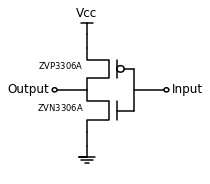

<css>

</css>

# Digital Laboratory

### Introduction

The 74HC ICs will tolerate a power supply between 2 V and 6 V however 3.3 V and 5 V are common choices for real circuits today. We will use 5 V through this laboratory. The laboratory power supplies are variable up to 30 V. We will use a linear 3‐terminal regulator, the 7805, which will produce 5 V output for an input of approximately 7 V or higher (it has a “dropout” voltage of 1.7 V as specified in the [datasheet](https://www.sparkfun.com/datasheets/Components/LM7805.pdf)).

### CMOS Inverter

Using a pair of MOSFETS we can create an inverter using the following circuit:

> **ATTENTION:** Be sure to connect the source (S) of the  ZVP3306A to the positive rail and the drain (D) to the drain of the ZVN3306A. Connect the input of the completed inverter to the output of the timer to obtain a clock with duty cycle between 10 and 20%. Verify by examination of the output with an oscilloscope.

### 2-Bit Adder

Implement the 2‐bit adder shown below. Use the 4-way DIP switches to encode the two 2-bit numbers. Use LEDs (with at least 100$\Omega$ in series to ground!) to indicate the 3-bit output (2-bit sum plus carry)
